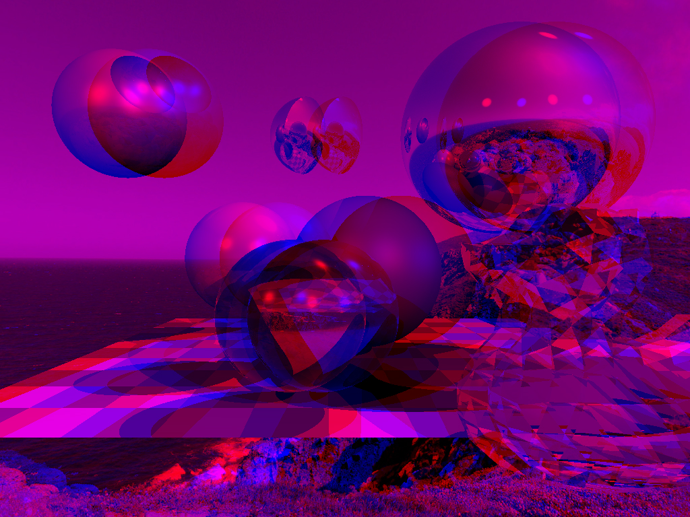

# Homework assignment

Final work:

- Top left: death star
- Top middle: intersection test (mirror)
- Bottom right: glass duck

---------------------

- Normal rendering:


- Parallax rendering:


- Stereoscope rendering:


## compilation
```sh
git clone --recurse-submodules https://github.com/mesabloo/tinyraytracer.git
cd tinyraytracer
git checkout homework_assignment
git submodule update --init
mkdir build
cd build
cmake ..  
make
```
